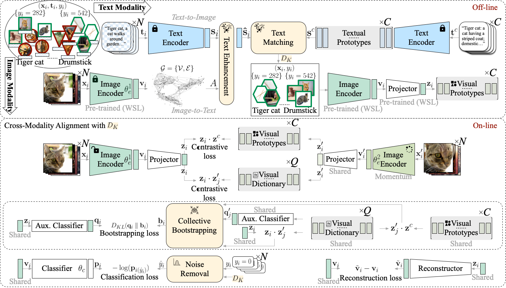

# CAPro: Webly Supervised Learning with Cross-modality Aligned Prototypes
## Submission to NeurIPS 455
## Abstract
Webly supervised learning has attracted increasing attention for its effectiveness in exploring publicly accessible data at scale without manual annotation. However, most existing methods of learning with web datasets are faced with challenges from label noise, and they have limited assumptions on clean samples under various noise. For instance, web images retrieved with queries of ``tiger cat'' (a cat species) and ``drumstick'' (a musical instrument) are almost dominated by images of tigers and chickens, which exacerbates fine-grained visual concept learning. In this case, exploiting both web images and their associated texts is a requisite solution to combat real-world noise. In this paper, we propose Cross-modality Aligned Prototypes (CAPro), a unified prototypical contrastive learning framework to learn visual representations with correct semantics. For one thing, we leverage textual prototypes, which stem from the distinct concept definition of classes, to select clean images by text matching and thus disambiguate the formation of visual prototypes. For another, to handle missing and mismatched noisy texts, we resort to the visual feature space to complete and enhance individual texts and thereafter improve text matching. Such semantically aligned visual prototypes are further polished up with high-quality samples, and engaged in both cluster regularization and noise removal. Besides, we propose collective bootstrapping to encourage smoother and wiser label reference from appearance-similar instances in a manner of dictionary look-up. Extensive experiments on WebVision1k and NUS-WIDE (Web) demonstrate that CAPro well handles realistic noise under both single-label and multi-label scenarios. CAPro achieves new state-of-the-art performance and exhibits robustness to open-set recognition.


## Illustration of Cross-Modality Alignment and Collective Bootstrapping
 to maintain semantically correct visual prototypes for noise reduction.
Collective bootstrapping (b) provides consistent label reference and regularization.
Our advantage (c) is highlighted in classes where semantic noise prevails due to polysemy concepts.")

## Overview of BoPro Architecture


## Dataset Download
In experiments, we use two large-scale web datasets with realistic noise: WebVision1k/Google500 and NUS-WIDE(Web).

### WebVision1k (WebVision 1.0)
The download link can be refered in <https://data.vision.ee.ethz.ch/cvl/webvision/download.html>.

~~We used the downsampled (256 * 256) version for convenience.~~

To improve performance, it is strongly encouraged to download the original sized version. Our preliminary experiments find that there exists a **noticeable** gap between the model trained on the resized and the original version. All experimental results are reported on the original version.

Download the dataset into ```./dataset/webvision1k```.

### Google500 (subset of WebVision1k)
The Google500 dataset uses the randomly sampled 500 classes from the 1000 classes in WebVision1k with images only sourced from Google. The detailed description of Google500 can be refered in <https://github.com/bigvideoresearch/SCC>.

Google500 is only used for ablation study.

### ImageNet1k & ImageNet500
In experiments, we also report the performance on ImageNet datasets, which correspond to the same classes in WebVision1k and Google500. We evaluate webly-supervised models on the validation set.

ImageNet1k can be refered in <https://image-net.org/download.php>.

Download the dataset into ```./dataset/imagenet```.

### NUS-WIDE (Web)
The download link can be refered in <https://lms.comp.nus.edu.sg/wp-content/uploads/2019/research/nuswide/NUS-WIDE.html>.
The official Web version of the NUS-WIDE is extracted from ```AllTags81.txt```. For each image, its user tags are compared with the chosen 81 concept tags to check if any of the 81 concept tag exists in the metadata of an image: 0 means ```non-exist```; 1 means ```exist```. These weak labels are not equivalent to the ground-truth labels which are provided in the folder ```AllLabels``` (e.g., ```Labels_airport.txt``` and ```Labels_animal.txt```).

We follow the official train/test split and these official web labels can be found respectively in ```./Train_Tags81.txt``` and ```Test_Tags81.txt```. We remove the images without any user tag from the 81 concepts. 

Download the dataset into ```./dataset/nus_wide_web```.

## Data Preparation

### TF-Record
In experiments, we use tfrecord format so that the I/O speed could be improved for training/evaluation.

Please check the ```./tfrecord/encode_tfrecord.py``` and fill in the root path of WebVision1k, ImageNet1k, and NUS-WIDE.

Please make sure the path is correct.

The dataset folder with examplar pathlist files can be downloaded in <https://drive.google.com/file/d/1r9s8OCsYQ4bkyG_66n9990LUxvFk5vcN/view?usp=share_link>. The results of tfrecord packaging should be similar to those exampler files.


### WebVision1k/ImageNet1k & Google500/ImageNet500 & NUS-WIDE (Web) filelist
The google500 filelist (filenames and categories) can be referred in SCC <https://github.com/bigvideoresearch/SCC>.

For compatibility, we keep all used filelist in ```./filelist```. Please download all the filelists from <https://drive.google.com/file/d/1gpGHhTrDH9UDuZwqYmOoXV06ynBZefrN/view?usp=share_link> for experiments on WebVision1k/Google500 and NUS-WIDE (Web).

Text files that end with "_tf.txt" refer to the format in TF-Record.
Some examples below:
* WebVision1k
    * Train: ```filelist/train_filelist_webvision_1k_usable_tf_knn_rerank_smoothed_meta_minilm.txt```
    * Val WebVision1k: ```filelist/val_webvision_1k_usable_tf.txt```
    * Val ImageNet1k: ```filelist/val_imagenet_1k_usable_tf.txt```

* Google500
    * Train: ```filelist/train_filelist_google_500_usable_tf_knn_rerank_smoothed_meta_minilm.txt```
    * Val Google500: ```filelist/val_webvision_500_usable_tf.txt```
    * Val ImageNet500: ```filelist/val_imagenet_500_usable_tf.txt```

* NUS-WIDE-WEB
    * Train: ```filelist/train_nus_81_tf_knn_rerank_smoothed_meta_minilm.txt```
    * Val: ```filelist/val_nus_81_tf.txt```

## Pre-training (vanilla) Weights
We provide the pretrained model weights in the ```vanilla_ckpt``` folder. Please download it from <https://drive.google.com/file/d/1cLBJ_-_KsUnScP0y739CAg5qOoT0yhdS/view?usp=sharing>.


## Training Shells
All the scripts can be found in the folder ```shells```.
* WebVision1k
    * step1 pre-training: ```shells/webvision1000/vanilla.sh```
    * step2 training: ```shells/webvision1000/meta_proto.sh```
    * step3 fine-tuning: ```shells/webvision1000/noise_clean.sh```
* Google500
    * step1 pre-training: ```shells/google500/vanilla.sh```
    * step2 training: ```shells/google500/meta_proto.sh```
    * step3 fine-tuning: ```shells/google500/noise_clean.sh```
* NUS-WIDE-WEB
    * step1 pre-training: ```shells/nuswide81/vanilla.sh```
    * step2 training: ```shells/nuswide81/meta_proto.sh```
    * step3 fine-tuning: ```shells/nuswide81/noise_clean.sh```

Enlightened by MoPro <https://arxiv.org/abs/2009.07995>, noise cleaning on the training dataset can be performed to further reduce the noise and improve performance by fine-tuning the classifier.
For example, use the script ```shells/webvision1000/noise_clean.sh``` for noise cleaning and fine-tuning on WebVision1k with Mix-Up <https://arxiv.org/abs/1710.09412> strategy.


## Training Weights
We provide the model weights in the ```ckpt``` folder. Please download it from <https://drive.google.com/file/d/1FpazfXlPfFdb7HcQcrz6brZ5m2Ym3aCe/view?usp=sharing>.


## Hyper-parameters
All the hyper-parameters are defined in ```./config_train.py```.


## Graph Building with K-reciprocal NN Reranking

All graph-related processing codes are in the folder ```graph```. We refer to <https://github.com/bigvideoresearch/SCC> for SGC smoothing.


## Acknowledgement
We would like to thank authors of SCC/VSGraph-LC <https://arxiv.org/abs/2008.11894> for their instruction on reproduction of SCC results on WebVision1k/Google500.
We also show gratitude to MoPro <https://arxiv.org/abs/2009.07995> for releasing code to the development of webly-supervised learning research.


